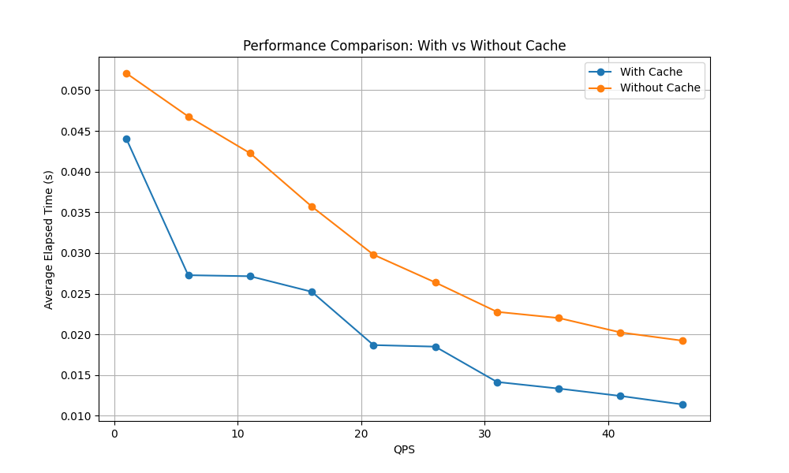

# Spring Boot with Redis, MySQL, and MyBatis

This repository demonstrates how to integrate Redis into a TODO application for caching purposes, improving the app's performance by reducing database query overhead.

## Repository
The TODO app's primary purpose is to manage tasks, and it is implemented with MySQL at [here](https://github.com/leduoyang/mysql-mybatis-app).

## Redis Setup
1. **Docker-Based Redis Setup**:
   Run Redis using Docker:
   ```bash
   docker run --name redis-container -p 6379:6379 -d redis
   # or using docker-compose provided under the folder /docker-compose to build containers of MySQL and Redis
   # docker-compose up --build
   ```
2. **Verify Redis Installation:**
   Ensure Redis is running by connecting to its CLI:
   ```bash
   docker exec -it redis-container redis-cli
   ```
3. **Access Redis CLI:**
   ```bash
   redis-cli -a {password}
   127.0.0.1:6379> GET task:1
   "{\"@class\":\"com.leduo.backend.data.entity.Task\",\"id\":1,\"title\":\"Learn Spring Boot\",\"description\":\"Work on a simple to-do app project\",\"status\":\"PENDING\",\"createdAt\":[\"java.util.Date\",1733369474000],\"updatedAt\":[\"java.util.Date\",1733369474000]}"
   127.0.0.1:6379> KEYS *
   1) "task:all"
   2) "task:1"
   ```

## Key Integration Points

1. **Cache Utility:**
   - Provides methods to interact with Redis, including `setValue` and `getValue`.

2. **Caching in Business Logic:**
   - For endpoints like `getAllTasks` and `getTaskById`, the application first checks Redis for cached data before querying the database.

3. **Cache Key Structure:**
   - Keys are designed to uniquely identify resources, such as:
     - `task:all` for all tasks.
     - `task:<taskId>` for individual tasks.

## Updates to Task Management

### Extended Data Model
- Tasks are now associated with additional entities:
  - **Project:** Contains information like project name and description.
  - **User:** Represents the user assigned to the task, including username and role.

### New Features
1. **Get Tasks by Project ID:**
   - Endpoint: `GET /project/{projectId}/task`
   - Returns all tasks associated with a specific project.

2. **Enhanced Task Details:**
   - Task responses now include:
     - Assigned user information (e.g., `username`, `role`).
     - Project details (e.g., `projectName`, `projectDescription`).

3. **New Parameter for GET Requests:**
   - A new parameter `byCache` is introduced to control whether to retrieve tasks directly from the database (`false`) or from the cache (`true`).
   - Example usage:
     ```bash
     curl -X GET "http://localhost:8080/tasks?byCache=true"
     ```

### Sample Updated Code for TaskService

```java
@Service
public class TaskService {

    @Autowired
    private CacheUtil cacheUtil;

    @Autowired
    private TaskRepository taskRepository;

    @Override
    public List<TaskResponse> getAllTasks(boolean byCache) {
        String cacheKey = "task:all";
        List<TaskDto> taskDtoList = null;
        if (byCache) {
            taskDtoList = (List<TaskDto>) cacheUtil.getValue(cacheKey);
        }
        final boolean isCache = (taskDtoList != null);
        if (taskDtoList == null) {
            taskDtoList = taskRepository.getAllTasks();
            cacheUtil.setValue(cacheKey, taskDtoList);
        }
        return taskDtoList.stream()
                .map(taskDto -> new TaskResponse()
                        .setId(taskDto.getTaskId())
                        .setTitle(taskDto.getTaskName())
                        .setDescription(taskDto.getDescription())
                        .setStatus(taskDto.getStatus())
                        .setAssignedTo(
                                new UserVo(
                                        taskDto.getAssignedTo().getUserId(),
                                        taskDto.getAssignedTo().getUsername(),
                                        taskDto.getAssignedTo().getRole()))
                        .setProject(
                                new ProjectVo(
                                        taskDto.getProject().getProjectId(),
                                        taskDto.getProject().getProjectName(),
                                        taskDto.getProject().getDescription()))
                        .setCreated_at(taskDto.getCreatedAt())
                        .setUpdated_at(taskDto.getUpdatedAt())
                        .setCache(isCache))
                .collect(Collectors.toList());
    }
}
```

## Performance Testing
A Python script was used to evaluate the performance improvement when using Redis for caching. The script simulates multiple GET requests to the application and measures response times. 

### Usage
Run the script as follows:
```bash
python3 performance_test.py --url "http://localhost:8080/api/v1/tasks?byCache=true" --qps_from $QPS_FROM --qps_to $QPS_TO --interval $INTERVAL --duration $DURATION
```

### Performance Visualization
Below is a comparison of the performance with and without caching:



## Configuration

- Update Redis configuration (e.g., host, port, password) in `application.properties`:
  ```properties
  spring.redis.host=localhost
  spring.redis.port=6379
  spring.redis.password={password}
  ```
